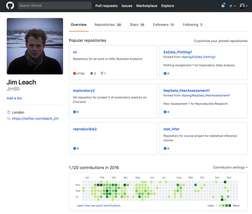

```{r setup, include = FALSE}
knitr::opts_chunk$set(fig.align = "center",
                      echo = FALSE,
                      message = FALSE,
                      warning = FALSE)

# Load the required libraries
library(tidyverse)
library(lubridate)
library(ggkpmg)
```

## In this session

* An overview of `git`
* How to `git`

<br>

<aside class="notes">
* Start with an overview of git, what is is, why it is
    * 30-40 mins
    * Break
* Git how-to. Technical, hands on. 
  * All installed git?
  * All installed SourceTree?
</aside>

## Who am I?

* Started at KPMG in 2012
* Early career as a data analyst
* Self study, then MSc Data Science
* Transferred to data scientist post-MSc
* `r as.numeric(ceiling(difftime(Sys.Date(), as.Date("2013-01-01"), units = "days")/365))` years using (and sometimes teaching) `git`

# An overview of `git`

## What is `git`?


<aside class="notes">
* Joke is that "no one" really knows what it is, just how to use/break it
* This is how most people (including me!) come to learn about `git`
* Hope today we will explain what `git` does, and how to use
* developed to help manage the (whole) linux kernel
* Similar to SVN/Microsoft TFS
* git is a system for:
    * collaboration
    * management
    * version control
</aside>

## Version control?

```
important_script.sql
important_script_v2.sql
important_script_v2_JIM.sql
important_script_v2_JIM_FINAL.sql
important_script_v2_FINAL_FINAL.sql
MASTER_important_script_v2_FINAL_FINAL.sql
```

<br>

> In collaborative settings based on email distribution, the original file swiftly becomes part of a complicated phylogeny that no amount of "Track Changes" and good intentions can resolve. - Prof. Jenny Bryan, UBC

<aside class="notes">
* You may have seen this on projects
    * I have, e.g. AH "the number"
* "Many people who don't use `git` unwittingly re-invent a poor man's version of it."
* Manual vc != good
* So we need an automated solution - enter `git`
</aside>

## What is `git`? {data-background="www/git-bg.jpg"}

* Free
* Built for collaboration
* Distributed

<aside class="notes">
* Free as in £, free as in open source
* Collaborative - enables many people to work on the same project code
    * Or just you and future-you
* Distributed - every "developer" has a complete history of the code
* Not just for code, anything that is _stored as_ text (e.g. Markdown not Word!)
can be controlled
</aside>

## What is `git` for us?

* "Track changes on steroids"
* Clear audit trail
* Minimise confusion

<aside class="notes">
* clear log of _every_ change on a project
    * go back and forward in time
    * get the code at a specific point in time
* View changes, comment on changes, accept/reject/merge
* Tools for collaboration, easily get your colleagues work, review it, change
it, enhance it etc
</aside>

## The `git` log


A history of _every_ change made to the code.

<aside class="notes">
* git tracks file evolution with a series of _commits_, each with an explanatory
message and unique ID
* gives us a timeline of the whole project
* We can use the messages to understand the changes
* We can use the ID to go backwards and forwards in time
* Built in audit-trail, future-me (and others) can understand
</aside>

## Tracking changes with `git`

```{r}
knitr::include_graphics("./www/commit-diff.png")
```

* Makes reviewing code very easy

<aside class="notes">
* Red = removed; green = added
* git will summarise one, or a thousand files
* demo jumping back and forth with SourceTree?
</aside>
    

```{r get-logs, message = FALSE, warning = FALSE, echo = FALSE}
# List out all files to be read in
files_dir <- list.files("./logs", pattern = ".tsv", full.names = T)
files <- gsub(".tsv", "", list.files("./logs", pattern = ".tsv"))

# Define function to read commit tsv (weird formatting prevents read_tsv)
read_commits <- function(commits_data, data_name) {
  readr::read_lines(commits_data) %>% 
    map(stringr::str_split, '\t') %>% 
    map(`[[`, 1) %>% 
    map(t) %>% 
    map(as_tibble) %>% 
    bind_rows() %>% 
    set_names(c("commit", "author", "datetime", "comment")) %>% 
    mutate(version = data_name)
}  

# Read in data
commits <- map2(files_dir, files, read_commits) %>% # Read in
  bind_rows()  # Collapse in to single table

commits_cln <- commits %>% 
  extract(version, "version_number", regex = "([[0-9]]+)", remove = FALSE) %>% 
  mutate(datetime = gsub("\\ \\+0000", "", datetime),
         datetime = ymd_hms(datetime),
         date = date(datetime),
         hour = hour(ceiling_date(datetime, unit = "hours")),
         day = wday(date, label = T, abbr = F),
         version_number = as.numeric(version_number),
         author = if_else(author == "Sara young", "Sara Young", author),
         author = if_else(author == "unknown", "Unknown", author)) %>%
  group_by(commit) %>% 
  mutate(earliest_version = min(version_number)) %>% 
  ungroup() %>% 
  filter(version_number == earliest_version) %>% 
  distinct() %>% 
  arrange(datetime) %>% 
  separate(version, c("label", "ver"), "_") %>% 
  select(-label) %>% 
  filter(version_number <=  9) %>% 
  mutate(ver = forcats::fct_reorder(ver, datetime, min))
```

## Project Osbourne

* Regulatory calculation & remediation

<br>

* Very messy data

<br>

* Dynamic requirements

<br>

* Tight deadlines

<aside class="notes">
* Vauge objectives = understood main but not _exact_ requirements
* Lots of messy data
* Cleaning rules importan
    * interpretation of codes in fields could have major impact
* Calculation logic evolved (rapidly) iterated over the the course of the project
    * And impact of changes needed
</aside>

## Project Osbourne

* Clear audit trails

<br>

* Code and work-product collaboration

<br>

* Strict version control

<aside class="notes">
* Needed a clear trail of what had happened
    * What code produced what numbers?
    * What was the impact to a change in calc logic
* 4-5 team members all needed to read, write, and collaborate on code
* Need to maintain strict versions to reproduce later
</aside>

## Commits vs time

```{r commits_vs_day, cache = TRUE}
commits_cln %>% 
  group_by(date) %>% 
  summarise(commits = n()) %>% 
  ggplot(aes(date, commits)) +
  geom_line(colour = kpmgcolours("primary")[1], size = 1.25) +
  labs(x = "Date", 
       y = "Commits",
       title = "Total commits per date",
       subtitle = "A single commit can represent dozens of changes across multiple code files") +
  theme_kpmg()
```

<aside class="notes">
* Here's an overview of commits per day
* We were busiest in late Jan and Feb
* But what this doesn't show is the changing between versions
</aside>

## Versions over time

```{r commit_versions_vs_date, cache = TRUE}
commits_cln %>% 
  group_by(version_number, date) %>% 
  summarise(commits = n()) %>% 
  ggplot(aes(date, commits)) +
  geom_line(aes(colour = as.factor(version_number)), size = 1.25) +
  scale_colour_manual(values = unname(kpmgcolours("graphs")[1:9])) +
  labs(x = "Date", 
       y = "Commits",
       title = "Total commits per date, per build version",
       subtitle = "Some versions overlapped as we switched back and forth\nbetween different calculation logics") +
  guides(colour = guide_legend("Build version", nrow = 2, byrow = T)) +
  theme_kpmg() +
  theme(legend.position = "bottom")
```

<aside class="notes">
* Each version of the code had slightly different rules/code
* Each "version" ~200 code files with logic for data cleaning, calculations, test suites etc
* git let us manage all those versions
* easily jump between them, compare results, asses the impact of changes to script logic
</aside>

## `git` hosting

```{r show_bb}

```

<aside class="notes">
* Lots of servies offering git _hosting_
* I.e. store a repository on the (private) web
* Within KPMG we use BitBucket - an Atlassian product
* Available through CloudOps in Lighthouse
</aside>

## `git` hosting

```{r show_bb2}
knitr::include_graphics("www/bb2.png")
```

<aside class="notes">
* Eeasy way for project overview, without local code
* Restrict access on a project-by-project basis
* Integrates with markdown
* Several related products, e.g. Jira and Confluence (also Atlassian) to give us full PM side of work
    * Jira: to do lists, issues, tasks etc
    * Confluence: documentation, articles, longer-form project
</aside>

## `git` for me

```{r gh}

```

<aside class="notes">
* GitHub != `git`. _GitHub_ is just another git hosting service
    * I don't pay, so it's public, but there are also paid private/enterprise versions
* I use it for tracking progress of personal projects
    * E.g. work from MSc
    * Personal blog, little projects etc
* Others use it to release software (e.g. the software I wrote the presentation with!)
</aside>

## Why `git`

* _Doing_ integrated with _organising, recording, disseminating, ..._
* Version control & audit trails
* Tools for QA
* Better use of the team
* Faster releases
* Structured collaboration
* Community

<aside class="notes">
* As the team _does_, they are already organising, recording...
* VC, tag, branch, test out new features in isolation (better management of code)
* Tools - diffs, pull requests, merges
    * Senior team discuss changes, junior team treat as QA opportunities
* Team can code "safely" in their own environment & only integrate changes after QA
    * Less time (money) spent integrating & fixing, focus on "doing", QA, and delivering
* Faster -> code, review, release (not a monolith)
* Less overhead as there is "one way" to collab - "enforced" standards
    * Distributed - hard for one person to "break" others' environments; reliable (burn it all down)    
* Community - people know it, less upskilling, better onboarding    
</aside>

## References

* Professor Jenny Bryan, UBC:
    * [Excuse me, do you have a moment to talk about version control?](https://peerj.com/preprints/3159v2/)
    * [Happy Git with R](http://happygitwithr.com/)
* [`git` - the simple guide](http://rogerdudler.github.io/git-guide/)
* `git` [book](https://git-scm.com/book/en/v2)

## Questions?

# How to `git`

## `git`

> Now the bad news: `git` was built neither for the exact usage described here, nor for broad usability. 

<aside class="notes">
* You will undoubtedly notice this so it's best to know in advance. 
* git is massive and complicated
    * but we don't need it all
* But there are many tools and habits that can soften the sharpest edges, and
reduce frustration.
* We will get the most gain for you pain.
    * But really, for not much pain there is a _lot_ of gain to be had
</aside>

## We're aiming to avoid this


## An instead get to this

<blockquote><p align="left">"If you're having `git` problems I feel bad for you, son. I got 99 problems but `git` ain't one."</p>
<footer><cite><a href="mailto:jim.leach@kpmg.co.uk?subject=having%20git%20problems">Anonymous</a></cite>
</footer>
</blockquote>


## Some encouragement


<aside class="notes">
* I started with git ~4 years ago
* I had no idea what I was doing
* I still have a lot to to learn
* But, look at me now - this can be you!
</aside>

## The details - how git works


Stores data as a series of _snapshots_ of a mini file system.

## Work flow - the three areas of git


<aside class="notes">
* Working directory - your files, the things you see on your computer
* Staging area - doesn't exist, it's a `git` concept
* `.git` directory - the repository - the "database" that stores the changes and "does git"
* Flow: make changes, `add` to staging area,  `commit` to save as a change
</aside>

## Basic `git`

Use:  `git <command>`

* `init`
* `status`
* `add`
* `commit`
* `diff`
* `log`
* `clone`
* `push`
* `pull`

[Reference](http://rogerdudler.github.io/git-guide/)

<aside class="notes">
* I've told you about 3 git areas, one of which doesn't exits
* I've shown you some weird looking commands
* Do you feel like this?
</aside>

## {data-background="www/confused.gif"}

<aside class="notes">
Don't worry, we'll take it step by step

1. Start with setting up a repository
1. Add some files
1. _Commit_ them to `git`
1. Make some changes
1. Add them
1. Commit them
</aside>

## Create a new repository

In SourceTree

* File > New > Create Local Repository
* Choose a location and repository name
    * The location will become your _working directory_
* Click "create"

```
cd path/to/my/project/directory
git init
```

<aside class="notes">
* May need to tell `git` who you are in SourceTree first
* Command is for the command line (if you're familiar great, don't worry if not)
* This will create the folder, and inside will be a (hidden) `.git` folder
* (May need to show hidden folders through control pannel)
* Can do this in folders that have files already
</aside>

## Doing & reviewing work

* Add some files (e.g. the ones I sent)
* These files are now in the _Working Directory_
* Remember, `git` manages code/text files
* See the files in SourceTree

```
git status
```


<aside class="notes">
* The new files will show up in SourceTree
    * Marked with ? - tells us they are new
* `git status` will show us these files on the command line
* Shows us new files in the _Working Directory_
</aside>

## Adding files to the index

* Right click a file in SourceTree
* Select 'Add to Index'
* Moves files in to the _Staging Area_

```
git add <filename>
git add *
git add *.R
git add *.sql
```

<aside class="notes">
* Remember - staging area is the one that "doesn't exist"
* This is us telling `git` to include these files in the next commit
* Not actually necessary in SourceTree, but I'm showing you here so you get
what's going on
    * Or if you want to work on command line!
</aside>

## Commiting files - saving changes

* Click file(s) in SourceTree (the checkbox)
* Enter a message
* Click "Commit"

```
git commit -m "A message that describes the changes"
```


<aside class="notes">
* Writes a new entry in the commit timeline
* The message should be an action:
    * "The purpose of this commit is to..."
* If you use the command line - remember to use a message!
</aside>

## Make some changes

* Open, edit, and save the files:
    * dplyr.R: Add `library(dplyr)`
    * pandas.py: Add `import pandas as pd`
    * select.sql: Add `select * from my_table`
    * readme.md: Remove `Some example text to remove later`
    
<aside class="notes">
* Use an editor (even notepad)
* You can make different changes if you want
* Just need something for git to pick up!
</aside>

## See your changes


You're looking at a `git diff`

```
git diff <filename>
```

<aside class="notes">
* Diff = summary of the changes made to a file
* Green = added
* Red = removed
* Add and commit these changes again
</aside>

## View the log

Use the _History_ tab to see the timeline in SourceTree


```
git log
```

<aside class="notes">
* Can view the log on cli with `git log`
* Can see, the commit message, the file(s) which were changed
* _What_ the changes were
* Who made them
* When they were made
</aside>

## Checkout a repository

In SourceTree:

* File > New > Clone from URL
    * Choose a location on your machine to save the code to
    * Give it a name
* Get a local copy of a repository's code

```
git clone <repository url>
```

<aside class="notes">
* Checkout - get a local copy of the files _and_ the repository (i.e. the commit log)
    * Hence _distributed_
* The other repository is called _remote_    
* Can also check out a "local" repository if it's actually a remote on a fileshare
* Clone the repo for this presentation
* The remote repository has the default name "origin"
</aside>

## Update your local copy

* Collaborator(s) update the repository you cloned
* You need to update
* SourceTree > Pull

```
git pull
```

<aside class="notes">
* Jim to make a change and submit that to the repo
* Full syntax `git pull origin master`
    * Pull from origin into our `master` branch
* Branches more complex - multiple timelines exising at once (e.g. for multiple versions)
* Will get the commit log, and overwrite changes in our local file
</aside>

## Send in your changes

* Add, commit as usual in SourceTree
* Then _Push_

```
git push
```

<aside class="notes">
* Push is used to send our _local_ changes to the _remote_ repository
* We can't `push` before we `pull`
* N.B. you won't be able to push to the pres. repository as you don't have permission to do so!
</aside>

## Some useful (advanced) functionality

* Undo changes (right click > _Reset_)
    * Back to the last commit, or a specific commit
* Create/delete a branch (click _Branch_)
* Switch branches (click on branch name under _Branches_) 
* _Tag_ a commit (right click > _Tag_)
* Make a "server" repository on a shared drive:

```
git init --bare /path/to/repo.git
```

<aside class="notes">
* branches are an "alternative timeline" - used to work on specific features/versions in isolation
* tags are really just labels on commits, useful for marking (e.g.) a release/version
* `bare` - without a working copy
* add `.git` extension by convention
* users can then `clone` and `push`/`pull` that repo
</aside>

# Summary

## What is `git`?

* "Track changes on steroids"
* Distributed
* Built for collaboration

<aside class="notes">
* Not GitHub - git is just software
</aside>


## Why `git`

* _Doing_ integrated with _organising, recording, disseminating, ..._
* Version control & audit trails
* Tools for QA
* Better use of the team
* Faster releases
* Structured collaboration
* Community

<aside class="notes">
* As the team _does_, they are already organising, recording...
* VC, tag, branch, test out new features in isolation (better management of code)
* Tools - diffs, pull requests, merges
    * Senior team discuss changes, junior team treat as QA opportunities
* Team can code "safely" in their own environment & only integrate changes after QA
    * Less time (money) spent integrating & fixing, focus on "doing", QA, and delivering
* Faster -> code, review, release (not a monolith)
* Less overhead as there is "one way" to collab - "enforced" standards
    * Distributed - hard for one person to "break" others' environments; reliable (burn it all down)    
* Community - people know it, less upskilling, better onboarding    
</aside>

## You may feel like this


<aside class="notes">
* Don't worry - it is.
</aside>

## But remember


<aside class="notes">
* But you can do it (I did)
* You can safely ignore large parts of git
    * They're not for us
* There are lots of excellent resources
</aside>

## Resources

* [This presentation](https://hdp-service.uk.kworld.kpmg.com/stash/projects/JL/repos/git/browse)
* Professor Jenny Bryan, UBC:
    * [Excuse me, do you have a moment to talk about version control?](https://peerj.com/preprints/3159v2/)
    * [Happy Git with R](http://happygitwithr.com/)
* [`git` - the simple guide](http://rogerdudler.github.io/git-guide/)
* [Atlassian](https://www.atlassian.com/git)
* [Atlassian cheatsheet](https://www.atlassian.com/git/tutorials/atlassian-git-cheatsheet)
* `git` [book](https://git-scm.com/book/en/v2)

## Questions?


